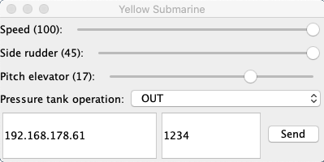

# Yellow Submarine

Dieses Projekt beschreibt den Prozess der Konzeptionierung und (hoffentlich) Konstruktion eines ferngesteuerten U-Boots mit der Fähigkeit zum statischen Tauchen. Die Steuerung erfolgt über einen im Boot verbauten NodeMCU ESP32 Controller, der über ein Smartphone angesprochen wird. Die Fähigkeit zum statischen Tauchen wird mit einem Kolbentank umgesetzt. Alle Komponenten werden selber entworfen, ausgelegt und gebaut.

## Baubericht

### 15.9.2020

* Arduino-Sketch zum Empfangen von UDP Nachrichten
* Desktop-App zum Generieren von Steuerkommandos und senden als UDP-Nachricht

** Achtung: ab hier beginnt der Bereich, der meine eigenen Notizen zum aktuellen Zeitpunkt beschreibt. Diese Informationen ändern sich stündlich. **

## Shops

* [Engel Modellbau](https://engel-modellbau.eu/shop/)
* [Modell-Ub-Boot-Shop](https://www.tauchrobotershop.de)

## Kolbentank

### Anleitungen

* [Anleitung Kolbentank, RC-Sub](https://www.rc-sub.de/mechanik/31-70mm-tauchtank)
* [Anleitung Kolbentank, Pressluftjunkies](http://zentrale.pressluftjunkies.net/index.php/de/projekte/newsfeeds/kolbentankbau)
* [Zweilochmuttern, DIN](http://www.fasteners.eu/de/standards/DIN/547/)

### Material

* Motor: [RB35, Conrad](https://www.conrad.de/de/p/modelcraft-rb350600-0a101r-getriebemotor-12-v-1-600-221936.html?gclid=Cj0KCQjwhvf6BRCkARIsAGl1GGimtMR-StjaftflzGFxRVpuXZrDfmshX5T4bXR6MQ_kuZ8rQXPsnSIaAk5LEALw_wcB&hk=SEM&WT.srch=1&WT.mc_id=google_pla&s_kwcid=AL%21222%213%21326955887696%21%21%21g%21%21&ef_id=Cj0KCQjwhvf6BRCkARIsAGl1GGimtMR-StjaftflzGFxRVpuXZrDfmshX5T4bXR6MQ_kuZ8rQXPsnSIaAk5LEALw_wcB%3AG%3As)
* Antriebszahnrad [Conrad, 6mm, variable Zahneanzahl, Modultyp 1](https://www.conrad.de/de/p/reely-stahlzahnrad-modul-typ-1-0-bohrungs-6-mm-anzahl-zaehne-15-231762.html)

### Bilder, Videos

* 
* 
* [YouTube-Video Kolbentank mit Servo](https://www.youtube.com/watch?v=r41CPMqIAeA&feature=youtu.be)

## Arduino/Programmierung

* NodeMCU ESP32: Zusätzliche Boardverwalter: *https://dl.espressif.com/dl/package_esp32_index.json*
* Send UDP package from macOS (IP: 192.168.178.61, POrt: 1234, Nachricht: "Sport")
		echo -n "Sport" | nc -4u -w1 192.168.178.61 1234 
* Fehler beim Upload auf Board: Boot-Taste gedrückt halten